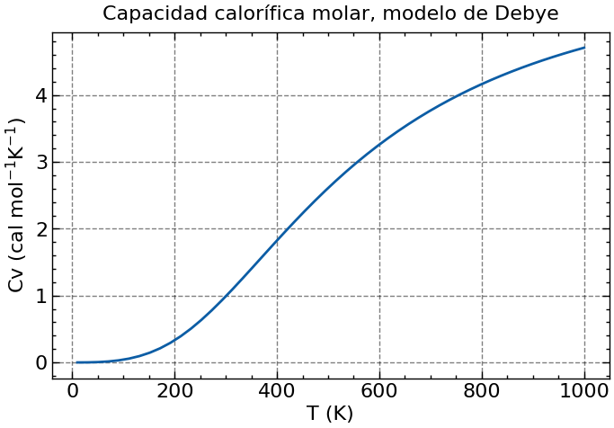

# DEBYE

### RESUMEN

Entregable de clase de Física del Estado Sólido sobre el modelo de Debye (enunciado en `Entregable_3.pdf`) resuelto en un cuaderno de Python 3.11.

### CÓMO USAR

1. Clone el repositorio y abra su carpeta desde la línea de comandos.

1. (Opcional) Crée un entorno virtual en el que instalar las dependencias con los comandos `python -m venv venv` seguido de `venv/Scripts/activate`.

1. Corra el comando `pip install -r requirements.txt` para instalar las dependencias.

Ahora debería de poder correr el cuaderno de Python sin problemas.

### REFERENCIAS

[1] Raman, C. V. (1957). The heat capacity of diamond between 0 and 1000° K. *Proceedings of the Indian Academy of Sciences - Section A, 46*(5), 323–332. doi:10.1007/BF03045982

[2] Desnoyers, J. E., & Morrison, J. A.  (1958). The heat capacity of diamond between 12·8° and 277°k. *The Philosophical Magazine: A Journal of Theoretical Experimental and Applied Physics, 3*(25), 42-48. doi:10.1080/14786435808243223